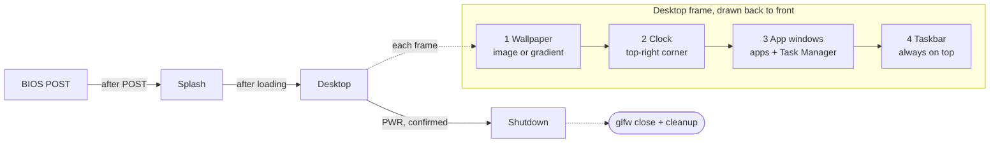

# CSOPESY Desktop OS Emulator — Project Spec Plan

Last updated: Oct 8, 2026

## Overview

We are building a single-window C++ application that looks and behaves like a minimal desktop OS shell: it boots through a retro BIOS screen and splash, then lands on a desktop with a wallpaper, live clock, taskbar, app windows and a Task Manager, and exits only through its PWR button. It is a convincing real-time graphical mockup, not a functional OS.

**Goals**

- Every item in the spec's "Checklist of Requirements" works and is demonstrable (Desktop, Taskbar, Task Manager).
- The app acts as its own compositor: one frame loop that draws the desktop first, then windows, then the taskbar, every frame.
- Clean, modular code that passes deterministic format, lint and test checks, so each member can own a feature without merge conflicts.

**In scope:** boot sequence, desktop, taskbar with at least 3 icon buttons, 2 unique app screens, Task Manager with dummy data, graceful PWR shutdown, the SOURCE submission and a Markdown Technical Report.

**Out of scope:** real process scheduling, a real file system, networking, real CPU/memory readings. All system data is placeholder.

**Source:** CSOPESY Semi-Major Output 2 spec (updated Sept 18, 2026), pages 1–3.

## Tech stack and build setup

The stack is fixed by the spec: C++ on GLFW + OpenGL + Dear ImGui; everything else below is a recommended default.

| Layer             | Choice                                                                        | Role                                                                                      |
| ----------------- | ----------------------------------------------------------------------------- | ----------------------------------------------------------------------------------------- |
| Language          | C++20                                                                         | `std::chrono`, `std::format` where the compiler supports it, `std::filesystem` for assets |
| Windowing / input | GLFW 3.4                                                                      | Creates the app window and GL context                                                     |
| Rendering         | OpenGL 3.3 core                                                               | Clears the frame, holds the wallpaper texture                                             |
| UI                | Dear ImGui (pinned master release tag; docking branch not used)               | All desktop, taskbar and window drawing                                                   |
| Image loading     | stb_image                                                                     | Loads the wallpaper into a GL texture                                                     |
| GL loader         | glad (generated for GL 3.3 core)                                              | Loads OpenGL function pointers                                                            |
| Build             | CMake ≥ 3.24 + Ninja, `CMakePresets.json`                                     | One reproducible build on every machine                                                   |
| Style guide       | [Google C++ Style Guide](https://google.github.io/styleguide/cppguide.html)   | Naming, headers, language-feature rules                                                   |
| Formatting        | clang-format, `BasedOnStyle: Google` (LLVM version pinned in CONTRIBUTING.md) | Enforced style, checked in CI-style script                                                |
| Linting           | clang-tidy (same version), including `google-*` checks                        | Static analysis, warnings as errors                                                       |
| Tests             | doctest                                                                       | Unit tests for non-UI logic                                                               |

**Repository layout**

```
csopesy-os/
  CMakeLists.txt
  CMakePresets.json
  .clang-format
  .clang-tidy
  .prettierrc
  .editorconfig
  .gitignore        build/, IDE folders, binaries, CLAUDE.md
  README.txt        names, build/run steps, entry point
  CONTRIBUTING.md   tool setup (LLVM, CMake, Ninja, bun), pinned versions, git conventions
  CLAUDE.md         agent instructions (local only, gitignored)
  cmake/            CompilerWarnings.cmake, Dependencies.cmake, Tooling.cmake
  third_party/      glad/, stb/ (vendored, unmodified)
  assets/           wallpaper.jpg, icons/, fonts/
  docs/
    spec/           split spec files (see Agent setup directives)
    report/         TECHNICAL_REPORT.md + diagrams/
  scripts/          check.sh, check.ps1
  src/
    main.cc         entry point: creates App and runs it
    core/           App, StateMachine, Clock, Theme
    boot/           BiosScreen, SplashScreen
    shell/          Desktop, Taskbar, WindowManager
    apps/           AppWindow, TaskManager, FileExplorer, Terminal
    data/           DummyProcessTable, TerminalCommands
  tests/            doctest unit tests for core/ and data/
```

- Use a monospace font (e.g. a bundled pixel or console font) for the boot screens and an ImGui default or sans font for the shell.
- Assets load relative to the executable path so the build runs from any working directory.

## Architecture

The app is one top-level state machine (BIOS → Splash → Desktop → Shutdown) driving a single frame loop that composites layers in a fixed order.



Boot runs once on timers; the Desktop state redraws its four layers every frame until a confirmed PWR moves it to Shutdown.

**Frame loop (one iteration per frame)**

1. `glfwPollEvents()`; exit the loop when `glfwWindowShouldClose()` is true (set by PWR, or by the OS close button, which is not blocked).
2. Start the ImGui frame (`ImGui_ImplOpenGL3_NewFrame`, `ImGui_ImplGlfw_NewFrame`, `ImGui::NewFrame`).
3. `state_machine.Update(dt)` then `state_machine.Render()` for the current state.
4. In the Desktop state, draw in this order: wallpaper (background draw list) → clock overlay → open app windows → taskbar (always on top).
5. `ImGui::Render()`, clear the GL buffer, render draw data, `glfwSwapBuffers()`.
6. After the loop: the same cleanup path runs however the loop ended (ImGui backends shutdown, textures deleted, `glfwTerminate`).

**Core modules**

| Module              | Responsibility                                                                                  |
| ------------------- | ----------------------------------------------------------------------------------------------- |
| `App`               | Owns GLFW window, ImGui context, state machine; runs the loop; performs cleanup                 |
| `StateMachine`      | Holds current `State` (`Bios`, `Splash`, `Desktop`, `Shutdown`), handles transitions and timers |
| `Clock`             | Returns formatted local date/time each frame via `std::chrono` + `std::put_time`                |
| `WindowManager`     | List of `AppWindow*`, open/close/focus/minimize, z-order, "running" flag for the taskbar        |
| `AppWindow` (base)  | `title_`, `is_open_`, `is_minimized_`, `virtual void Draw()`; each app subclasses it            |
| `Theme`             | Colors, fonts, rounding, spacing; applied once at startup                                       |
| `DummyProcessTable` | Holds the fixed list of fake process rows used by the Task Manager and the Terminal's ps        |

**Key design rules**

- Desktop and taskbar are ImGui windows with `NoTitleBar | NoResize | NoMove | NoBringToFrontOnFocus` (desktop) and fixed position/size from `ImGui::GetMainViewport()` so they track window resizes.
- App windows are normal ImGui windows constrained to the area above the taskbar.
- No global mutable state outside `App`; features receive references to `WindowManager` and `Clock`.

## Feature: Boot sequence

The app opens on a BIOS POST screen, then an ASCII-logo splash with a loading indicator, then hands off to the desktop. The spec shows both screens as reference images; they are not on the requirements checklist, so treat them as expected polish.

**F1. BIOS / POST screen**

- Black full-window background, monospace light-grey text, top-left aligned.
- Content mirrors the reference: product name, release date, copyright line, a memory test that counts up (e.g. `Checking RAM : 0K` → `64000K OK`), CPU type, BIOS version, processor lines, and the IDE drive list (Primary/Secondary Master/Slave).
- Lines appear progressively (typewriter or line-by-line on a timer) for a real-time feel.
- Optional "Fun Fact" footer line.
- Duration ~3–5 s, or skip on any key/click.

**F2. Splash / loading screen**

- Centered ASCII-art logo ("CSOPESY") in a blue accent color.
- Under it: emulator name and version, author credit, project tagline.
- Animated green "Loading." → "Loading.." → "Loading..." cycling every ~0.4 s.
- Duration ~2–3 s, then fade or cut to the Desktop state.

**Acceptance criteria**

- [ ] Launching the app always shows BIOS → Splash → Desktop in that order.
- [ ] Text animates in real time; no frame freezes during the sequence.
- [ ] Both screens fill the window and stay correct when it is resized.

## Feature: Desktop

The desktop is the full-window base layer, drawn first every frame, carrying the wallpaper, a real-time clock in a fixed corner, and the PWR shutdown control.

**F3. Wallpaper (required)**

- Implemented as a borderless, non-movable ImGui window covering the whole viewport (the taskbar draws on top), or via `ImGui::GetBackgroundDrawList()`.
- Primary option: a loaded image texture (stb_image → `glTexImage2D` → `ImGui::Image`/`AddImage`), scaled to cover the viewport while keeping aspect ratio.
- Fallback if the image fails to load: a vertical color gradient via `AddRectFilledMultiColor`, so the app never shows a blank screen.
- Optional desktop label (e.g. "CSOPESY OS v1.0 — System Online") in a corner.

**F4. Real-time clock (required)**

- Read local time every frame with `std::chrono::system_clock::now()`; format as `Thursday, Oct 08, 2026 | 07:43 PM`.
- Fixed in the top-right corner inside a small dark, semi-transparent rounded panel.
- Anchored to viewport size so it stays in the corner when the window resizes.

**F5. PWR shutdown (required)**

- A "PWR" button (red text) in the taskbar's system tray area.
- Clicking opens a confirmation modal ("Shut down CSOPESY OS?" — Shut Down / Cancel).
- Confirm → `Shutdown` state: brief "Shutting down..." screen (~1 s), then `glfwSetWindowShouldClose(window, true)` and the normal cleanup path.
- PWR is the designed, graceful exit. The title-bar X and Alt+F4 are not intercepted; they end the loop through the same cleanup path, so nothing is ever force-killed.

**Acceptance criteria**

- [ ] Wallpaper fills the entire window at any size and is the first layer drawn.
- [ ] Clock seconds/minutes visibly advance without user input.
- [ ] PWR → Shut Down closes the app cleanly with exit code 0; Cancel returns to the desktop.

## Feature: Taskbar

The taskbar is a fixed bottom panel, always on top, with at least three clickable icon buttons: two open unique app screens and one opens the Task Manager. It also shows which apps are running and holds the system tray.

**F6. Layout**

- Full width, ~56–64 px tall, pinned to the bottom of the viewport; dark semi-opaque background with a thin top border.
- Left: app launcher icons. Right: system tray (VOL, NET, PWR).
- Flags: `NoTitleBar | NoResize | NoMove | NoScrollbar | NoSavedSettings`; recomputed from `GetMainViewport()` each frame.

**F7. App icon buttons (required: ≥ 3)**

| Button                | Opens               | Notes               |
| --------------------- | ------------------- | ------------------- |
| App A (File Explorer) | Unique UI screen #1 | Folder icon         |
| App B (Terminal)      | Unique UI screen #2 | Own icon and color  |
| Task Manager          | Task Manager window | Activity/graph icon |

- Round or rounded-square buttons drawn with `ImageButton` (icon textures) or `Button` + draw-list shapes; colored text labels are acceptable, as in the reference.
- Hover: lighter background + tooltip with the app name.
- Click behavior: closed → open and focus; open and focused → minimize; minimized or behind → restore and focus.

**F8. Running-app indicators**

- A small dot or underline under each icon whose window is open; brighter when focused.
- Driven by `WindowManager` state, not by the button itself.

**F9. System tray**

- VOL and NET: placeholder buttons that open small popups (volume slider, "Connected: CSOPESY-LAN").
- PWR: red, triggers the shutdown flow (F5).

**Acceptance criteria**

- [ ] At least 3 icon buttons; each opens its window on click.
- [ ] Taskbar stays visible above every app window and at the bottom after resizing.
- [ ] Running indicators match which windows are open.

## Feature: Unique app screens

Two taskbar buttons must each open a unique UI screen with placeholder information; any design is acceptable, so we pick two that look clearly different and show off ImGui widgets.

**Shared window behavior (AppWindow base)**

- Movable, resizable ImGui window with title bar; close (X) sets `is_open_ = false`.
- A minimize button (custom, in the title area or menu bar) hides it but keeps it "running" on the taskbar.
- Clicking a window brings it to front; it cannot be dragged below the taskbar.
- Default size and position set with `ImGuiCond_FirstUseEver`, staggered so new windows don't stack exactly.

**F10. App A — File Explorer**

- Left pane: folder tree (`TreeNode`) — This PC, Documents, Pictures, Downloads, System32.
- Right pane: table of dummy files (Name, Type, Size, Date modified) for the selected folder, with sortable headers (`ImGui::BeginTable` + `ImGuiTableFlags_Sortable`).
- Top: back/forward buttons and an address bar showing the current path (read-only text).
- Bottom status bar: "12 items | 3 selected".

**F11. App B — Terminal**

- Look: black background, monospace green or light-grey text, a prompt such as `C:\CSOPESY>`, and a startup banner with the OS name and version.
- Layout: a scrolling output region (`BeginChild` with auto-scroll to bottom on new output) above a single-line `InputText` with `ImGuiInputTextFlags_EnterReturnsTrue`; focus returns to the input after each command.
- Command history: Up/Down arrows cycle previous commands via an `InputText` history callback.
- Placeholder commands, all printing fake output:

| Command         | Output                                             |
| --------------- | -------------------------------------------------- |
| `help`          | List of available commands                         |
| `ver`           | `CSOPESY OS v1.0`                                  |
| `date` / `time` | Current date / time from `Clock`                   |
| `echo <text>`   | Echoes the text                                    |
| `ps`            | The Task Manager's dummy process list in text form |
| `whoami`        | `csopesy\user`                                     |
| `cls`           | Clears the scrollback                              |
| `exit`          | Closes the Terminal window (not the OS)            |
| anything else   | `'<cmd>' is not recognized as a command.`          |

- Command parsing and output live in `data/TerminalCommands` as plain functions (input string → output lines) with no ImGui calls, so they are unit-tested directly.

**Acceptance criteria**

- [ ] Each screen has its own layout, not a copy of the other or of the Task Manager.
- [ ] Both show placeholder data and respond to basic interaction (select, type, sort).
- [ ] Open, minimize, restore and close all work from the window and the taskbar.

## Feature: Task Manager

The Task Manager is a window that closely resembles Windows Task Manager, with a Processes table showing each process's CPU and memory usage from dummy values.

The spec asks for exactly two things here: a Windows-like look and a placeholder Processes table with dummy CPU and memory values. Nothing else is required; anything beyond is optional polish.

**F12. Look and layout**

- Modeled on the Windows Task Manager "Processes" view: title "Task Manager", a slim tab strip with "Processes" selected, then the table filling the window.
- Column headers show the totals above their names, as Windows does (e.g. `31%` over CPU, `58%` over Memory).
- Rows grouped under "Apps (n)" and "Background processes (n)" header rows.
- CPU and Memory cells shaded pale to darker yellow as the value rises.
- Default size ~720 × 480, resizable.

**F13. Processes table (required)**

| Column | Example             |
| ------ | ------------------- |
| Name   | `csopesy_shell.exe` |
| Status | Running             |
| CPU    | 3.4%                |
| Memory | 128.6 MB            |

- Built with `BeginTable` (`RowBg | BordersInnerV | ScrollY`, frozen header row); numbers right-aligned.
- Rows come from `DummyProcessTable`: a fixed list of ~20 fake processes defined in one place, so the screen is identical on every run and easy to test.
- Totals in the header are computed from the rows (CPU capped at 100%).

**Optional polish (only if time allows):** small random jitter on values each second, column sorting, an "End task" button.

**Acceptance criteria**

- [ ] Opens from its taskbar button and is recognizably the Windows Task Manager Processes view.
- [ ] Table shows each process with its CPU and memory usage, all dummy values.
- [ ] Header totals match the sum of the rows.

## Requirements traceability

Every bullet in the spec's checklist maps to one feature above; the boot screens are extra polish taken from the reference images.

| Spec requirement       | Spec bullet                                                                          | Feature                        |
| ---------------------- | ------------------------------------------------------------------------------------ | ------------------------------ |
| Desktop                | Full-screen base layer, rendered first each frame                                    | F3, Architecture frame loop    |
| Desktop                | Fills the entire application window                                                  | F3                             |
| Desktop                | Wallpaper: gradient, ImGui pattern, or image texture                                 | F3 (image + gradient fallback) |
| Desktop                | Real-time clock, updated every frame, fixed corner                                   | F4                             |
| Desktop                | PWR button as shutdown; no force exit                                                | F5, F9                         |
| Taskbar                | Fixed panel at top or bottom                                                         | F6                             |
| Taskbar                | Shows running applications                                                           | F8                             |
| Taskbar                | ≥ 3 clickable icon buttons                                                           | F7                             |
| Taskbar                | Two buttons open unique UI screens with placeholder info                             | F10, F11                       |
| Taskbar                | Third button opens the Task Manager                                                  | F7, F12                        |
| Task Manager           | Closely resembles Windows Task Manager                                               | F12                            |
| Task Manager           | Placeholder Processes table with CPU and memory, dummy values                        | F13                            |
| SOURCE                 | Source code, README.txt with names, run instructions and entry file (or GitHub link) | D1                             |
| PPT (Technical Report) | Cover, video walkthrough, architectural diagram, code snippets, design discussion    | D2                             |
| (Reference images)     | BIOS POST and splash screens                                                         | F1, F2                         |

## Deliverables

Two things are submitted: the SOURCE (as a GitHub link) and the technical report, which we write as Markdown in `docs/report/` and paste into slides later instead of authoring a PPT directly.

**D1. SOURCE**

- Submitted as a **GitHub repository link**. The repo holds all source, CMake files, assets and the quality-gate config (`.clang-format`, `.clang-tidy`, `.prettierrc`, `scripts/`).
- Never committed: `build/`, `.vs/`, binaries, IDE caches and `CLAUDE.md`; `.gitignore` enforces this.
- `README.txt` at the repo root containing:
  - Group member names.
  - Requirements: OS, compiler (e.g. MSVC 2022 / GCC 13 / Clang 17), CMake ≥ 3.24, Ninja.
  - Build and run steps, copy-pasteable: `cmake --preset release`, `cmake --build --preset release`, then the path of the executable.
  - Entry point: `src/main.cc`, which holds `int main()` and creates the `App` class (`src/core/app.cc`) that runs everything. (C++ has no "entry class"; this sentence answers the spec's question.)
  - A pointer to `CONTRIBUTING.md` for developer tooling and the check script.

**D2. Technical Report (`docs/report/TECHNICAL_REPORT.md`)**

Written for any reader, from a first-year student to the instructor: every idea is explained in plain words first, with code only to illustrate it. It is never a line-by-line walk through the code.

Each `## Slide N — <title>` heading maps to one slide; under it go 3–5 short bullets (slide text) and a `> Notes:` block (what the presenter says). Diagrams live in `docs/report/diagrams/` as Mermaid source plus an exported PNG.

| Slide | Content                                                                                                                              | Spec item             |
| ----- | ------------------------------------------------------------------------------------------------------------------------------------ | --------------------- |
| 1     | Cover: project title, course, group name and members, date                                                                           | Cover                 |
| 2     | Video walkthrough: link, plus a timestamped outline (boot, desktop, each app, PWR)                                                   | Video Walkthrough     |
| 3     | What we built, in one picture: a screenshot of the desktop with labels                                                               | Design discussion     |
| 4     | Key idea: immediate-mode UI, explained with an analogy (redrawing a whiteboard every frame vs. moving sticky notes)                  | Design discussion     |
| 5     | Architectural diagram: state flow + per-frame layer order, and the module map                                                        | Architectural Diagram |
| 6–9   | One slide per feature (Desktop, Taskbar, Task Manager, Terminal + File Explorer): what it does, the design choice, one short snippet | Code Snippets         |
| 10    | Code quality: formatting, linting and tests, and why they were automated                                                             | Design discussion     |
| 11    | Challenges and trade-offs (e.g. layering, resizing, keeping UI and data apart)                                                       | Design discussion     |
| 12    | Conclusion and what we'd add next                                                                                                    | Design discussion     |

**Rules for code snippets**

- 5–8 snippets total, each ≤ 15 lines, trimmed to the idea being shown (`// ...` for omitted parts).
- Each one has a one-line caption above (what it does) and one or two sentences below (why it was done this way).
- Pick snippets that show a design decision: the frame loop, layer order, `AppWindow` base class, the taskbar toggle logic, the Processes table, the terminal command dispatcher.

**Writing rules:** short sentences; define each term the first time (immediate mode, compositor, frame, draw list); a glossary on the last slide notes if needed.

## Build system (CMake)

One CMake setup builds identically on every member's machine: pinned dependencies, presets instead of hand-typed flags, strict warnings on our code only, and tests and lint wired in as targets.

**Rules**

- `cmake_minimum_required(VERSION 3.24)`; C++20 with `CMAKE_CXX_STANDARD_REQUIRED ON` and `CMAKE_CXX_EXTENSIONS OFF`.
- `CMAKE_EXPORT_COMPILE_COMMANDS ON` so clang-tidy and editors see the real flags.
- Modern, target-based CMake only: `target_*` commands, never global `include_directories`, `add_definitions` or `CMAKE_CXX_FLAGS` edits.
- No in-source builds: configure fails if the build dir equals the source dir.
- Dependencies: GLFW, Dear ImGui and doctest via `FetchContent` pinned to exact release tags in `cmake/Dependencies.cmake`; glad and stb_image vendored unmodified in `third_party/`. Never "latest" or a branch name.
- Dear ImGui has no CMake file of its own, so we define an `imgui` static library from its core sources plus `imgui_impl_glfw` and `imgui_impl_opengl3`.
- Third-party include dirs are marked `SYSTEM` so their warnings never fail our build or lint.
- Post-build step copies `assets/` next to the executable (`$<TARGET_FILE_DIR:csopesy_os>`).

**Targets**

| Target                    | Type       | Contents                                                   |
| ------------------------- | ---------- | ---------------------------------------------------------- |
| `imgui`                   | static lib | Dear ImGui core + GLFW/OpenGL3 backends                    |
| `csopesy_core`            | static lib | Everything in `src/` except `main.cc`                      |
| `csopesy_os`              | executable | `main.cc`, links `csopesy_core`                            |
| `csopesy_tests`           | executable | doctest tests, links `csopesy_core`; registered with CTest |
| `format` / `format-check` | custom     | Apply / verify clang-format                                |
| `tidy`                    | custom     | Run clang-tidy on `src/` and `tests/`                      |

**Warnings (`cmake/CompilerWarnings.cmake`, applied to our targets only)**

- MSVC: `/W4 /permissive- /WX`
- GCC / Clang: `-Wall -Wextra -Wpedantic -Wshadow -Wconversion -Wsign-conversion -Wold-style-cast -Wnon-virtual-dtor -Werror`
- Toggle: `CSOPESY_WARNINGS_AS_ERRORS` (default ON).

**Presets (`CMakePresets.json`, Ninja generator, output in `build/<preset>/`)**

| Preset    | Purpose                                                           |
| --------- | ----------------------------------------------------------------- |
| `debug`   | Day-to-day work; debug symbols; ASan + UBSan on GCC/Clang         |
| `release` | Optimized build for the demo and submission                       |
| `ci`      | Release + tests + warnings as errors; what `scripts/check.*` uses |

Standard commands: `cmake --preset debug`, `cmake --build --preset debug`, `ctest --preset debug`.

## Coding standards

All C++ follows the [Google C++ Style Guide](https://google.github.io/styleguide/cppguide.html), plus the project and Dear ImGui rules below. Wherever a rule can be checked by a tool, the tool enforces it (see Quality gates) rather than code review. Where this section is silent, the Google guide decides.

**Naming (Google style, enforced by clang-tidy `readability-identifier-naming`)**

| Element                               | Style                           | Example                                |
| ------------------------------------- | ------------------------------- | -------------------------------------- |
| Namespaces                            | snake_case                      | `csopesy::shell`                       |
| Classes, structs, enums, type aliases | PascalCase                      | `WindowManager`, `enum class AppState` |
| Enum values                           | `k` + PascalCase                | `AppState::kDesktop`                   |
| Functions, methods                    | PascalCase                      | `DrawTaskbar()`                        |
| Accessors / mutators                  | snake_case, matching the member | `is_open()`, `set_is_open()`           |
| Local variables, parameters           | snake_case                      | `frame_time`                           |
| Class data members                    | snake_case + trailing `_`       | `is_open_`                             |
| Struct data members                   | snake_case, no trailing `_`     | `cpu_percent`                          |
| Constants, `constexpr`                | `k` + PascalCase                | `kTaskbarHeight`                       |
| Macros (avoid)                        | UPPER_SNAKE with project prefix | `CSOPESY_DEBUG`                        |
| Files                                 | snake_case, `.h` / `.cc`        | `task_manager.h`, `task_manager.cc`    |

Dear ImGui's own API is already PascalCase (`ImGui::Begin`), so our function names read consistently next to it.

**Google style rules we rely on most**

- `#define` header guards, not `#pragma once`, in the form `CSOPESY_SRC_<DIR>_<FILE>_H_` (e.g. `CSOPESY_SRC_CORE_APP_H_`); clang-tidy `llvm-header-guard` is configured to that pattern.
- Include order, set by clang-format: related header, C system headers, C++ standard headers, other libraries (GLFW, ImGui, glad), project headers; each group separated by a blank line. Include what you use; no forward declarations of types from other libraries.
- Everything inside `namespace csopesy { ... }` (with sub-namespaces per folder); no `using namespace` directives anywhere; unnamed namespaces for file-local helpers in `.cc` files.
- No exceptions thrown by our code: errors are returned (`bool`, `std::optional`, or a small result struct) and checked at startup (GLFW, GL loader, texture load).
- No run-time type info (`dynamic_cast`, `typeid`) in our code; virtual dispatch through `AppWindow` instead.
- `explicit` on single-argument constructors; copy/move operations declared explicitly (`= default` / `= delete`) on every class that owns a resource.
- 2-space indent, 80-column limit, `char* p` pointer alignment: all applied by clang-format, never by hand.
- `auto` only when the type is obvious from the line or truly noisy (iterators, lambdas).
- Comments: Google-style file and class comments on public headers; inside functions, comments only to explain _why_. No commented-out code.

**Project C++ rules (on top of Google)**

- RAII for every resource: the GLFW window, GL textures and ImGui context are owned by classes whose destructors release them. No raw `new` / `delete`; `std::unique_ptr` owns, references or plain pointers borrow.
- `const` everywhere it fits, `[[nodiscard]]` on functions whose result must be used, `enum class` only, `std::string_view` for read-only string parameters.
- No global mutable state; no singletons.
- No magic numbers: sizes, colors and timings live in `Theme` or named `constexpr` values.
- C++ casts only (`static_cast`, etc.); no C-style casts.
- `core/Clock` formatting, `data/` and `StateMachine` logic never include `imgui.h` or GL headers, so they can be unit-tested without a window.

**Dear ImGui rules**

- `Begin()` / `BeginChild()` → always call the matching `End()` / `EndChild()`, whatever `Begin` returned.
- `BeginTable`, `BeginPopup`, `BeginPopupModal`, `BeginTabBar`, `BeginMenu` → call the matching `End*` **only** if `Begin*` returned true.
- Every `PushStyleColor` / `PushStyleVar` / `PushID` / `PushFont` is popped in the same function, same count.
- IDs: unique labels; `##suffix` to hide an ID (`"##terminal-input"`), `###id` when the visible text changes but identity must not (window titles with counters); `PushID(i)` inside loops.
- Immediate mode means no UI state in ImGui: window open/minimized flags, selections and input buffers live in our classes, never in `static` locals inside draw functions.
- Draw functions draw and report actions; they do not own app logic. Example: the taskbar returns "Task Manager clicked" and `WindowManager` decides what that means.
- Fixed panels (desktop, taskbar, clock) are placed every frame with `SetNextWindowPos/Size` from `GetMainViewport()->WorkPos/WorkSize`.
- Window flag combinations are named `constexpr ImGuiWindowFlags` values, not repeated inline.
- All styling goes through `Theme` (applied once at startup with `ImGui::GetStyle()`); no ad-hoc colors inside features.
- Define `IMGUI_DISABLE_OBSOLETE_FUNCTIONS`; `ShowDemoWindow` only in debug builds behind a flag. Debug builds keep `IM_ASSERT` on, so unbalanced Begin/End or Push/Pop fails loudly during development.

## Quality gates and deterministic testing

One command, `scripts/check.sh` (or `scripts/check.ps1` on Windows), runs every check in a fixed order and gives the same pass/fail on any machine, because tool versions, configs, file lists and test inputs are all pinned.

**What makes it deterministic**

- Pinned tools: clang-format and clang-tidy share one LLVM major version, chosen once during Phase 1 setup and recorded in CONTRIBUTING.md; Prettier is pinned to an exact version. The script checks versions first and fails with a clear message on a mismatch.
- Pinned config: `.clang-format`, `.clang-tidy`, `.prettierrc` and `.editorconfig` are committed; no tool runs on defaults.
- Fixed file set: files come from `git ls-files` (sorted), always excluding `third_party/` and `build/`.
- No hidden inputs in tests: no wall clock, no randomness, no window or GPU. `Clock` takes an injected time point; `DummyProcessTable` is a fixed list (any optional jitter uses a fixed-seed generator written by us, since `std::` distributions differ across standard libraries).
- Warnings are errors in the `ci` preset, so a warning can't pass on one machine and fail on another.

**Gates, in order (the script stops at the first failure)**

| #   | Gate                | Command                                                                     | Fails when                                        |
| --- | ------------------- | --------------------------------------------------------------------------- | ------------------------------------------------- |
| 1   | Tool versions       | `clang-format --version`, `clang-tidy --version`, `bunx prettier --version` | A tool is missing from PATH or the wrong version  |
| 2   | C++ formatting      | `clang-format --dry-run --Werror` on `src/` and `tests/`                    | Any file differs from the style                   |
| 3   | Markdown formatting | `bunx prettier@<pinned> --check "docs/**/*.md"`                             | Spec or report Markdown is not formatted          |
| 4   | Configure + build   | `cmake --preset ci && cmake --build --preset ci`                            | Any compiler warning or error                     |
| 5   | Unit tests          | `ctest --preset ci --output-on-failure`                                     | Any doctest case fails                            |
| 6   | Static analysis     | `clang-tidy -p build/ci` on `src/` and `tests/`                             | Any enabled check fires (`WarningsAsErrors: '*'`) |
| 7   | Layering            | Search `src/data/` and the logic files for `imgui.h` / GL includes          | UI headers leak into testable logic               |

**Config baselines**

- `.clang-format`: `BasedOnStyle: Google` with no overrides except `IncludeBlocks: Regroup` and `IncludeCategories` matching the Google include order (related header, C system, C++ standard, third-party, project).
- `.clang-tidy`: enable `google-*`, `bugprone-*`, `cppcoreguidelines-*`, `modernize-*`, `performance-*`, `readability-*`, `misc-*`, plus `llvm-header-guard`; `readability-identifier-naming` configured to the Google naming table above. Disable only with a written reason, e.g. `modernize-use-trailing-return-type` (conflicts with Google style) and `cppcoreguidelines-pro-type-vararg` (ImGui's `Text()` is variadic by design). `HeaderFilterRegex` limited to `src/`.
- `.prettierrc`: `proseWrap: "preserve"`, `printWidth: 100`, so diffs on the report stay readable.

**Unit tests (doctest, `tests/`)**

| Area                | Example cases                                                                                       |
| ------------------- | --------------------------------------------------------------------------------------------------- |
| `Clock`             | Fixed time point formats as `Thursday, Oct 08, 2026 \| 07:43 PM`; midnight and noon edge cases      |
| `StateMachine`      | BIOS → Splash after its duration; Splash → Desktop; PWR confirm → Shutdown; Cancel stays on Desktop |
| `WindowManager`     | Taskbar click toggles open → focus → minimize → restore; running flags match open windows           |
| `TerminalCommands`  | Each command's exact output lines; unknown command message; `cls` clears; history order             |
| `DummyProcessTable` | Row count, totals equal row sums, CPU total capped at 100%                                          |

UI drawing itself is verified by the manual test checklist in the Milestones section; the gates cover everything that can be checked without a screen.

**Optional:** a git pre-commit hook that runs gates 2–3, and a GitHub Actions workflow that runs the same script on `windows-latest` and `ubuntu-latest`.

**Tool setup (`CONTRIBUTING.md`)**

Not everyone has clang tools on PATH yet, so `CONTRIBUTING.md` walks each member through setup and records the pinned versions everyone must match.

| Tool                            | Windows                                                                  | macOS                                                          | Linux                                       |
| ------------------------------- | ------------------------------------------------------------------------ | -------------------------------------------------------------- | ------------------------------------------- |
| LLVM (clang-format, clang-tidy) | `winget install LLVM.LLVM`, then add `C:\Program Files\LLVM\bin` to PATH | `brew install llvm@<N>`, then add its `bin` to PATH (keg-only) | `apt.llvm.org` script for version `<N>`     |
| CMake ≥ 3.24 + Ninja            | `winget install Kitware.CMake Ninja-build.Ninja`                         | `brew install cmake ninja`                                     | Package manager                             |
| bun (for Prettier)              | `winget install Oven-sh.Bun`                                             | `brew install oven-sh/bun/bun`                                 | `curl -fsSL https://bun.sh/install \| bash` |

- During Phase 1, pick the newest stable LLVM major version, write it into `CONTRIBUTING.md` as `<N>`, and have every member install that exact major version.
- A "Verify your setup" step: run `clang-format --version`, `clang-tidy --version`, `cmake --version`, `ninja --version`, `bun --version`, then `scripts/check`.
- It also documents the git conventions (Conventional Commits, `feat/…` / `fix/…` branches) and how to open a PR for review.

## Milestones and task breakdown

Build in five phases so a working, submittable app exists after phase 3 and later phases only add polish.

1. **Skeleton and tooling** — spec split into `docs/spec/` (see Agent setup directives), CMake presets and pinned dependencies, `.clang-format` / `.clang-tidy` / `.prettierrc`, `scripts/check.*`, CONTRIBUTING.md with tool setup, one passing doctest, GLFW window with an ImGui demo window. _Done when `check` passes on every member's machine._
2. **Shell core** — `StateMachine`, `WindowManager`, `AppWindow` base, `Clock`, `Theme` and fonts, each with unit tests; Desktop state with gradient wallpaper and clock.
3. **Required features** — image wallpaper, taskbar with 3 buttons and running indicators, PWR shutdown with confirm, Task Manager Processes table with dummy data, File Explorer and Terminal with placeholder content. _Done when every row of the traceability table passes and `check` is green._
4. **Boot sequence and polish** — BIOS POST and splash screens, hover tooltips, VOL/NET popups, Task Manager color shading, optional extras.
5. **Report and submission** — `TECHNICAL_REPORT.md`, diagrams, video walkthrough, `README.txt`, resize and clean-machine testing, final `check` run.

**Suggested work split (4 members)**

| Area                           | Features                                                  | Depends on                                  |
| ------------------------------ | --------------------------------------------------------- | ------------------------------------------- |
| Core, build and boot           | CMake, quality gates, App loop, state machine, F1, F2, F5 | —                                           |
| Desktop and taskbar            | F3, F4, F6–F9, WindowManager                              | Core                                        |
| Task Manager and File Explorer | F12, F13, F10, DummyProcessTable                          | AppWindow base                              |
| Terminal and report            | F11, TerminalCommands, D1, D2                             | AppWindow base; all features for the report |

**Test checklist**

- [ ] `scripts/check` passes from a clean clone (all seven gates).
- [ ] Cold launch shows BIOS → Splash → Desktop with no console errors or ImGui asserts in a debug build.
- [ ] Resize the window small and large: wallpaper, clock, taskbar and windows stay correctly placed.
- [ ] Open, minimize, restore, close each app from both the taskbar and its window.
- [ ] Open all three apps at once; overlap and focus order behave correctly.
- [ ] Terminal: every listed command works; Up/Down history works; unknown commands show the error line.
- [ ] PWR → Shut Down exits cleanly; Cancel returns to the desktop.
- [ ] Missing wallpaper file falls back to the gradient without crashing.
- [ ] README steps, followed exactly on a machine without the dev setup, produce a running build.

## Agent setup directives

A coding agent working on this project must first turn this document into a set of Markdown spec files with an explicit build order, get them approved, and only then write code, one phase at a time.

**Step 1: on initialization, before any code**

1. Read this whole plan.
2. Split it into the files below. Copy requirements and acceptance criteria word for word; do not invent new scope.
3. Format them with the pinned Prettier (`bunx prettier@<pinned> --write docs/spec`).
4. Show the user the file tree and `BUILD_ORDER.md`, and wait for approval before starting Phase 1.

```
docs/spec/
  README.md                 index of all spec files and how they relate
  BUILD_ORDER.md            phases in order; tasks inside each phase in order, each with its dependencies and a [ ] status box
  00-overview.md            goals, scope, tech stack
  01-architecture.md        state machine, frame loop, modules, layer order
  02-build-system.md        CMake rules, targets, presets
  03-coding-standards.md    C++ and Dear ImGui rules
  04-quality-gates.md       check script, gates, configs, unit test list
  features/
    F01-bios-screen.md  ...  F13-processes-table.md    one file per feature
    D1-source.md             D2-technical-report.md
  phases/
    phase-1-skeleton-and-tooling.md
    phase-2-shell-core.md
    phase-3-required-features.md
    phase-4-boot-and-polish.md
    phase-5-report-and-submission.md
```

- Every feature file has: ID, summary, spec requirement it satisfies, depends on, files it touches, acceptance criteria, unit tests to write.
- Every phase file has: goal, feature IDs included, task order, exit criteria (all its acceptance boxes ticked + `scripts/check` green).

**Step 2: standing rules while building**

- Follow `BUILD_ORDER.md` strictly; never start the next phase until the current one meets its exit criteria and the user approves.
- Run `scripts/check` before calling any task done. Never disable a lint check, loosen a warning or skip a test to get green; raise it with the user instead.
- Follow the Google C++ Style Guide and the project Coding standards; comments only to explain why or to document. When unsure about a style point, check the Google guide rather than guessing.
- The spec files are the source of truth: if the code needs to differ, propose the spec edit first.
- Tick `[ ]` boxes in `BUILD_ORDER.md` and the phase file as tasks finish, and add a short line to `docs/report/notes.md` on any design decision, so the Technical Report writes itself later.
- It may check PATH for `cmake`, `ninja`, a compiler, `clang-format`, `clang-tidy` and `bun`, and report anything missing or at the wrong version.
- Git: standard Conventional Commits and feature branches (`feat/taskbar`, `fix/clock-format`). Never commit, create branches, push or open PRs until the user has reviewed and approved.

**Where the directives live:** the standing rules above go in a root `CLAUDE.md`, which is listed in `.gitignore` and never committed. On first run the agent creates it, adds `CLAUDE.md` to `.gitignore`, and confirms with `git check-ignore CLAUDE.md`. If clang tools are missing from PATH, it points the user to the setup table in `CONTRIBUTING.md` instead of skipping those gates.
