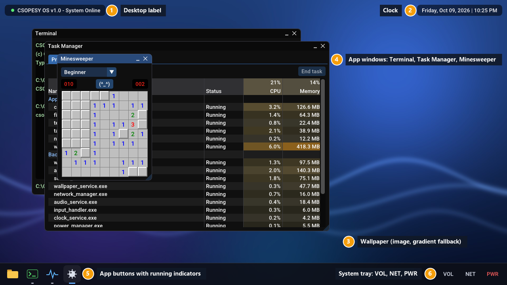
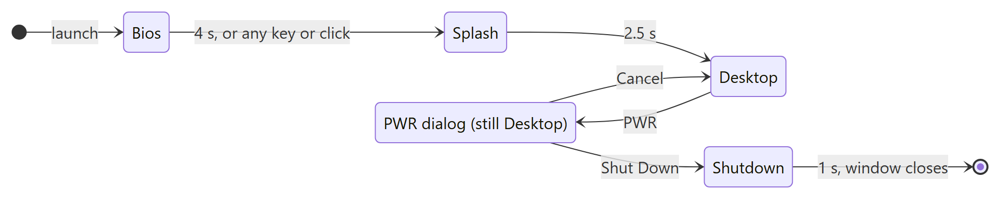
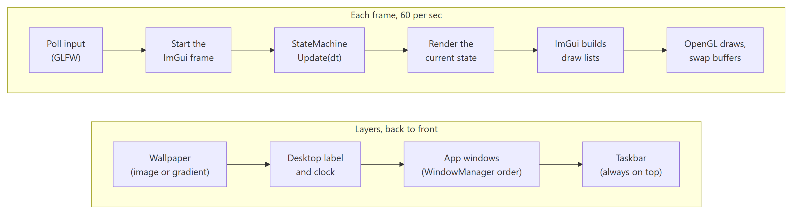
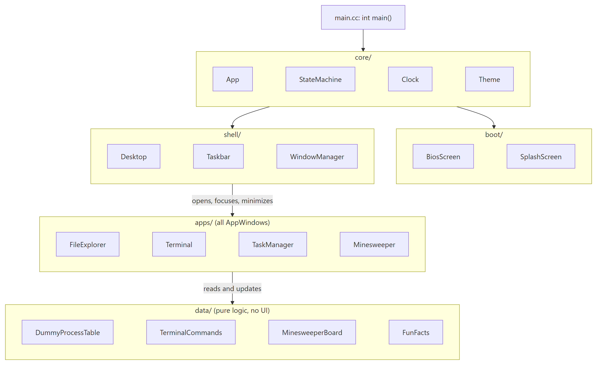
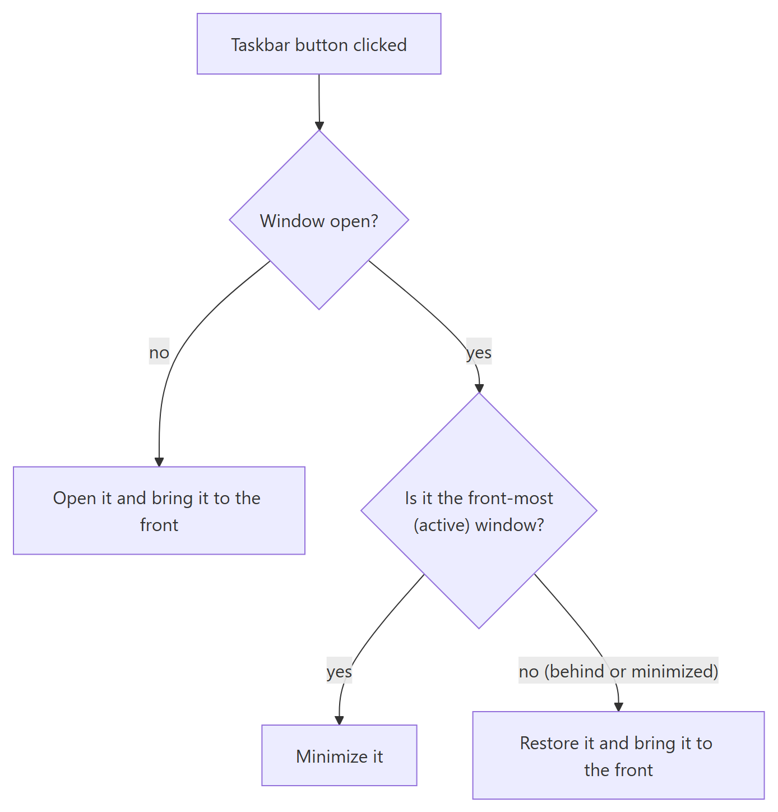

# CSOPESY Desktop OS Emulator — Technical Report

Each `## Slide N` section is one slide: the bullets are the slide text and the `> Notes:` block is what the presenter says. Diagrams are in [`diagrams/`](diagrams/) (Mermaid source plus PNG) and screenshots in [`images/`](images/).

## Slide 1 — CSOPESY Desktop OS Emulator

- A desktop operating system shell, mocked up in C++20 with Dear ImGui
- CSOPESY - Section S01 - Group 12
- Trinidad, Nathan · Singh, Nathaniel · Quilantang, Jann Miro · Saguin, VL Kirsten Camille
- October 2026

> Notes: Good day. We are Group 12 of CSOPESY section S01. Our project is a desktop OS emulator: one application window that boots like a real computer and then shows a desktop with a taskbar, a clock and four apps. Nothing in it is a real operating system. The processes, files and CPU numbers are all placeholder data, because the goal was the shell's design, not an actual kernel.

## Slide 2 — Video walkthrough

- Video: _(link to be added after recording)_
- 0:00 Boot: BIOS POST screen with a fun fact, then the splash screen
- 0:20 Desktop: wallpaper, clock, taskbar tooltips, VOL and NET popups
- 0:45 Apps: File Explorer, Terminal, Task Manager, Minesweeper; open, minimize, restore, close
- 2:15 PWR: Cancel, then Shut Down, and the app exits cleanly

> Notes: The video follows the order of a real session. It starts from a cold launch so you see the BIOS and splash screens. Then it opens every app from the taskbar and shows minimize, restore and close from both the taskbar and the window. In the Terminal we run help, date, time, ps, an unknown command, and the Up arrow for history. In the Task Manager we sort a column and end a task. It ends with the PWR button: first Cancel, then Shut Down, after which the window closes by itself.

## Slide 3 — What we built, in one picture



- (1) Desktop label and (2) clock in fixed corners, (3) wallpaper behind everything
- (4) App windows: File Explorer, Terminal, Task Manager, and a Minesweeper game
- (5) Taskbar buttons show which apps are running; (6) the tray holds VOL, NET and PWR
- Before the desktop: a BIOS POST screen and a splash screen

> Notes: This is the whole system in one screen. The numbered parts match what the specification asked for: a full-screen desktop with a wallpaper and a real-time clock, a taskbar with at least three app buttons and running indicators, a Task Manager that looks like the Windows one, two more unique app screens, and a PWR button that shuts down cleanly. The Minesweeper game, the desktop label and the BIOS fun fact are extras we added on top.

## Slide 4 — The key idea: immediate-mode UI

- Most UI toolkits keep a tree of widget objects alive: "retained mode"
- Dear ImGui is "immediate mode": every frame, the code describes the whole screen again
- A frame is one redraw of the window, about 60 per second
- Analogy: redrawing a whiteboard from scratch each time instead of moving sticky notes around
- So all state (open windows, selections, typed text) lives in our classes, not in the UI library

> Notes: This idea shapes the whole design. In a retained-mode toolkit you create a button once and it stays there. In immediate mode there are no button objects. Every frame we call a function that says "draw a button here", and it returns true if it was clicked this frame. Think of a whiteboard: instead of keeping sticky notes and moving them, we wipe the board and redraw everything about sixty times a second. That is simple to reason about, because what you see is always exactly what the code drew this frame. The catch is that ImGui forgets everything between frames, so whether a window is open, which row is selected and what the user typed must all be stored in our own classes.

## Slide 5 — Architecture







- A state machine drives the app: Bios, Splash, Desktop, Shutdown
- One frame loop: poll input, update the state, draw, show the frame
- The desktop is drawn back to front: wallpaper, label and clock, app windows, taskbar
- Modules depend in one direction: core, then shell and boot, then apps, then data

> Notes: Three pictures explain the architecture. The first is the state machine. The app always starts in Bios, moves to Splash on a timer, then to Desktop, and leaves the desktop only through PWR and a confirmation. The second is the frame loop that runs every frame, and the layer order inside the Desktop state. Like a painter, we draw the back first, so the taskbar, drawn last, always stays on top. The third is the module map. App in core owns everything. The shell manages windows, the apps draw them, and data holds pure logic with no UI code at all, which is why it is easy to test.

## Slide 6 — Desktop: frame loop and layer order

- `App::Run` is the single loop; PWR and the OS close button share one cleanup path
- The wallpaper is an image texture, scaled to cover the window; a gradient is drawn if the file is missing
- The wallpaper, desktop label and clock go on ImGui's background draw list, which renders under every window
- The clock is formatted by a pure `Clock` class that takes an injected time, so it is unit-tested

The frame loop, run once per frame until the window closes:

```cpp
while (glfwWindowShouldClose(window.get()) == GLFW_FALSE) {
  glfwPollEvents();
  BeginFrame();
  Update(Seconds{ImGui::GetIO().DeltaTime});
  Render();
  if (state_machine_.should_exit()) {
    glfwSetWindowShouldClose(window.get(), GLFW_TRUE);
  }
  EndFrame(window.get());
}
// GL objects must be freed while the context still exists.
desktop_.ReleaseWallpaper();
```

There is no `exit()` call anywhere: shutting down only asks the loop to stop, so cleanup always runs the same way.

The desktop's base layers, back to front:

```cpp
void Desktop::Draw(const core::Clock& clock) const {
  const ScreenRect bounds = MainViewportRect();
  ImDrawList& draw_list = *ImGui::GetBackgroundDrawList();
  DrawWallpaper(draw_list, bounds);
  DrawLabel(draw_list, bounds);
  DrawClock(draw_list, bounds, clock);
}
```

A draw list is ImGui's list of shapes to paint this frame. The background list is always painted before any window, so the layer order needs no extra bookkeeping.

> Notes: Every frame goes through this one loop. Shutting down never kills the process. The state machine sets a flag, the loop ends, and the same cleanup runs whether you pressed PWR or the window's X button. For the desktop, we place the wallpaper and the clock using the window's current size every frame, which is why they stay correct when you resize. The wallpaper keeps its aspect ratio by cropping the overflowing side, like a phone wallpaper. If the image cannot be loaded, a gradient is drawn instead of crashing.

## Slide 7 — Taskbar and window management

- Four app buttons with drawn icons, hover tooltips, and a bar showing which apps are running
- The tray: VOL (volume slider and mute), NET (connection info), PWR (shutdown dialog)
- `WindowManager` decides what a click does; the taskbar only reports clicks
- Every app derives from one `AppWindow` base class with title bar, minimize and close

What a taskbar click does, as in Windows:

```cpp
void WindowManager::ToggleFromTaskbar(apps::AppWindow& window) {
  if (IsActive(window)) {
    window.Minimize();
    active_ = nullptr;
    return;
  }
  window.Open();
  Activate(window);
}
```



Keeping this rule out of the drawing code means it is unit-tested without a window: a closed app opens, the front app minimizes, and an app that is behind or minimized comes to the front.

> Notes: The taskbar is a fixed panel at the bottom that is placed again every frame, and it is raised above the app windows each frame so it is never covered. Its buttons are drawn with simple shapes instead of image files. We separated drawing from deciding. The taskbar only says "this button was clicked", and the window manager applies the Windows rule. Click a closed app and it opens. Click the app in front and it minimizes. Click one that is behind or minimized and it comes to the front. The indicator under each button reads the same state: grey when running, a longer blue bar when it is the active window.

## Slide 8 — Task Manager

- Modeled on the Windows Task Manager Processes view, with group rows for Apps and Background processes
- About 20 fake processes come from one `DummyProcessTable`, shared with the Terminal's `ps`
- Column totals sit above the column names; CPU and Memory cells shade from pale yellow to amber
- Extras: values jitter each second, columns sort on click, and "End task" removes a process

The rows of one group, in the order the user picked:

```cpp
// ... result holds pointers to this group's rows, in table order
std::ranges::stable_sort(result, [column, descending](
                                     const ProcessRow* first,
                                     const ProcessRow* second) {
  const std::partial_ordering order = CompareBy(*first, *second, column);
  if (order != 0) {
    return descending ? order > 0 : order < 0;
  }
  return first->name < second->name;
});
```

Sorting is a pure function, so it is tested on its own. Ties fall back to name order, so equal values never jump around between frames.

> Notes: The spec asked for two things here: a Windows look and a placeholder process table with CPU and memory. The table is an ImGui table with a frozen header row. We draw our own header so each column total sits above its name, like Windows does. The data lives in one place and is shared, so the Terminal's ps command shows exactly the same processes. For the extras, the values jitter a little every second from a fixed-seed random generator we wrote ourselves, so tests still give the same result every run. Click a column name to sort, and select a row and click End task to remove it.

## Slide 9 — Terminal and File Explorer

- Terminal: a command-prompt look with `help`, `ver`, `date`, `time`, `echo`, `ps`, `whoami`, `cls`, `exit`
- Up and Down arrows walk the command history; unknown commands print an error line
- File Explorer: a folder tree, an address bar with back and forward, and a sortable file table
- Both show placeholder data; the command logic is pure text in and text out

The command dispatcher, which knows nothing about windows or drawing:

```cpp
const std::string command = ToLower(name);
if (command == "help") {
  return {.lines = HelpLines()};
}
if (command == "date") {
  return PrintLine(std::format("The current date is: {}", context.date));
}
// ...
if (command == "cls") {
  return {.lines = {}, .effect = CommandEffect::kClearScreen};
}
return PrintLine(std::format("'{}' is not recognized as a command.", name));
```

Commands return lines plus an effect such as "clear the screen", and the Terminal window applies it. So every command is tested as plain strings.

> Notes: The two required "unique screens" are deliberately different from each other and from the Task Manager. The Terminal is a black console with a prompt. Typing a command calls RunCommand, which takes a string and returns output lines. It never touches the window. That is how we unit-test every command, including the error message. The File Explorer looks like Windows Explorer: a tree on the left, an address bar with back and forward buttons, and a table you can sort by clicking a column, with Ctrl-click multi-select and a status bar.

## Slide 10 — Code quality

- One script, `scripts/check`, runs seven gates in order and stops at the first failure
- Formatting (clang-format, Prettier) and linting (clang-tidy, Google C++ style) are checked, never by hand
- 139 unit tests with doctest, including UI tests that run ImGui with no window or GPU
- Warnings are errors, and a layering gate stops UI code from leaking into the data logic

> Notes: We automated quality so it does not depend on who is reviewing. The check script runs, in order: tool versions, clang-format, Prettier for the docs, a build with warnings as errors, the tests, clang-tidy, and a custom check that data files never include ImGui or OpenGL headers and that every header has the right guard. We never turned a lint rule off to get green. When clang-tidy complained, we changed the code. For the UI we run ImGui headless: a context with no window. We feed it fake mouse clicks and key presses, which lets us test the taskbar and terminal like a user would. The script also passed from a fresh clone of the repository.

## Slide 11 — Challenges and trade-offs

- Keeping UI and data apart: logic in `data/` is pure, so it is tested without a screen
- Focus vs. the taskbar: clicking a taskbar button steals focus, so we track the active window ourselves
- Resizing: everything fixed is placed from the window size every frame, and windows are clamped above the taskbar
- Immediate mode means we own all state, which is more code but no hidden state

> Notes: The hardest bugs came from immediate mode and focus. When you click a taskbar button, ImGui gives focus to the taskbar, so by the time we ask "which window is active?" the answer is wrong. We solved it by tracking the active window in our window manager. Resizing was handled by never storing positions for fixed panels: the taskbar, clock and wallpaper are recomputed from the window size each frame. App windows are clamped so their title bar can never slide under the taskbar. In testing we also found that ImGui's default window background is slightly transparent, so overlapping windows showed each other's text, and we made them opaque. The trade-off overall: more code to hold state ourselves, but nothing happens that the code did not ask for.

## Slide 12 — Conclusion and next steps

- Every item of the specification is covered, plus BIOS and splash screens from the reference images
- Extras: Minesweeper, a wallpaper picker that remembers your choice, BIOS fun facts, Task Manager sorting, jitter and End task
- Next: real file browsing, a process scheduler simulation behind the Task Manager, saved settings
- Lesson: separating what to show from what to draw made the system easy to test and change

> Notes: To sum up, the emulator meets every point of the specification and adds a boot sequence and some fun extras, such as a working Minesweeper and fun facts on the BIOS screen. These can be edited in assets/fun_facts.txt without changing code. If we continued, the natural next step for an operating systems course would be to put a real scheduling simulation behind the Task Manager, so the numbers come from simulated processes instead of fixed data. Thank you.
>
> Glossary: **Frame**: one complete redraw of the window. **Immediate mode**: a UI style where the code describes the whole screen every frame. **Draw list**: ImGui's list of shapes to paint in a frame. **Compositor**: the part that stacks layers (wallpaper, windows, taskbar) into the final image. **State machine**: a set of states with fixed rules for moving between them.
