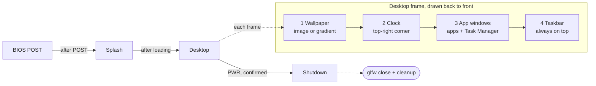

# 01 — Architecture

The app is one top-level state machine (BIOS → Splash → Desktop → Shutdown) driving a single frame loop that composites layers in a fixed order.

Boot runs once on timers; the Desktop state redraws its four layers every frame until a confirmed PWR moves it to Shutdown.

## Frame loop (one iteration per frame)

1. `glfwPollEvents()`; exit the loop when `glfwWindowShouldClose()` is true (set by PWR, or by the OS close button, which is not blocked).
2. Start the ImGui frame (`ImGui_ImplOpenGL3_NewFrame`, `ImGui_ImplGlfw_NewFrame`, `ImGui::NewFrame`).
3. `state_machine.Update(dt)` then `state_machine.Render()` for the current state.
4. In the Desktop state, draw in this order: wallpaper (background draw list) → clock overlay → open app windows → taskbar (always on top).
5. `ImGui::Render()`, clear the GL buffer, render draw data, `glfwSwapBuffers()`.
6. After the loop: the same cleanup path runs however the loop ended (ImGui backends shutdown, textures deleted, `glfwTerminate`).

## Core modules

| Module              | Responsibility                                                                                  |
| ------------------- | ----------------------------------------------------------------------------------------------- |
| `App`               | Owns GLFW window, ImGui context, state machine; runs the loop; performs cleanup                 |
| `StateMachine`      | Holds current `State` (`Bios`, `Splash`, `Desktop`, `Shutdown`), handles transitions and timers |
| `Clock`             | Returns formatted local date/time each frame via `std::chrono` + `std::put_time`                |
| `WindowManager`     | List of `AppWindow*`, open/close/focus/minimize, z-order, "running" flag for the taskbar        |
| `AppWindow` (base)  | `title_`, `is_open_`, `is_minimized_`, `virtual void Draw()`; each app subclasses it            |
| `Theme`             | Colors, fonts, rounding, spacing; applied once at startup                                       |
| `DummyProcessTable` | Holds the fixed list of fake process rows used by the Task Manager and the Terminal's ps        |

## Key design rules

- Desktop and taskbar are ImGui windows with `NoTitleBar | NoResize | NoMove | NoBringToFrontOnFocus` (desktop) and fixed position/size from `ImGui::GetMainViewport()` so they track window resizes.
- App windows are normal ImGui windows constrained to the area above the taskbar.
- No global mutable state outside `App`; features receive references to `WindowManager` and `Clock`.

## Shared window behavior (AppWindow base)

- Movable, resizable ImGui window with title bar; close (X) sets `is_open_ = false`.
- A minimize button (custom, in the title area or menu bar) hides it but keeps it "running" on the taskbar.
- Clicking a window brings it to front; it cannot be dragged below the taskbar.
- Default size and position set with `ImGuiCond_FirstUseEver`, staggered so new windows don't stack exactly.
